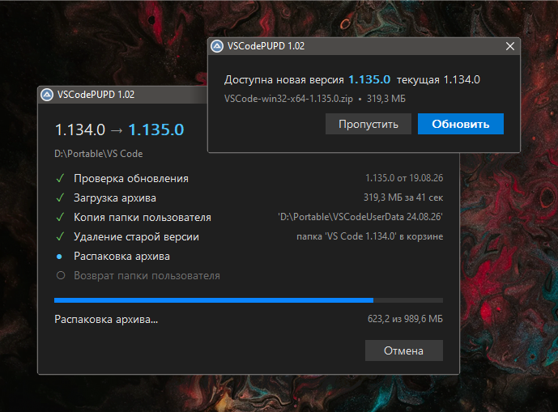

# &nbsp; VSCodePUPD

 

Портативный [Visual Studio Code](https://code.visualstudio.com/docs/setup/portable) не умеет обновляться автоматически.
VS Code Portable Updater берет на себя эту рутину.

### Как это работает

Вместо прямого запуска `Code.exe` запускаете `VSCodePUPD.exe` из соседней папки, можно пробросить аргументы командной строки в случае необходимости.

Утилита проверит обновления и предложит их установить.

Папка `VSCode` указывается пользователем при первом запуске, далее весь нужный контекст утилита собирает сама, и ссылку для загрузки обновлений, и путь папки пользователя для резервирования.

### Возможности

- Проверка обновлений при каждом запуске, без фонового агента и служб
- Загрузка с докачкой и проверка архива по SHA-256
- Перенос папки пользователя целиком, включая настройки и расширения
- Удаление только через корзину
- Проброс аргументов командной строки в `Code.exe`
- Восстановление после сбоя: если обновление прервалось, папка пользователя вернётся на место при следующем запуске
- Проверка блокировки папки до загрузки: держателей видно списком
- Журнал работы в `VSCodePUPD.log`

### Зависимости

Windows 10 версия 1803 или новее: программа использует `curl.exe` из состава системы. На более старых системах загрузка идёт через встроенный в AutoIt механизм, но без докачки.

